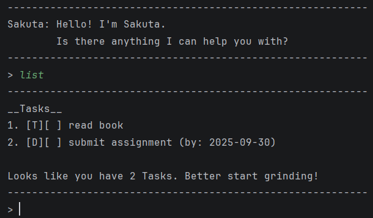

# Sakuta User Guide



Sakuta is a command-line task management chatbot that helps you keep track of your todos, deadlines, and events efficiently!

It allows you to:
1. Add different types of tasks
2. Mark and unmark tasks
3. Delete tasks
4. Search for tasks
5. Automatically save tasks to a file (sakuta.txt)

All tasks data is stored locally in `./data/sakuta.txt`.

## Adding Todos

Adds a simple task without a specific time constraint.

Format:
`todo DESCRIPTION`
- Adds a todo task called DESCRIPTION to the task list.

Example:
`todo read book`

Expected output:

```
Sakuta: I have added — read book
```

## Adding Deadlines

Adds a deadline task with a specified due date.

Format:
`deadline DESCRIPTION /by DUE_DATE`
- Adds a deadline task called DESCRIPTION with DUE_DATE to the task list.

Example:
`deadline submit assignment /by 2025-09-30`


Expected output:

```
Sakuta: I have added — submit assignment
```

## Adding Events

Adds an event task with a start and end date.

Format:
`event DESCRIPTION /from START_DATE /to END_DATE`
- Adds an event task called DESCRIPTION with START_DATE and END_DATE to the task list.

Example:
`event hackathon /from 2025-10-01 /to 2025-10-03`

Expected output:

```
Sakuta: I have added — hackathon
```

## Marking a task

Marks a specified task as completed.

Format:
`mark TASK_NUMBER`
- Marks the task at the specified TASK_NUMBER. The TASK_NUMBER refers to the number shown in the displayed task list. The number must be a positive integer.

Example:`mark 2`, `mark 3`

Expected output:

```
Sakuta: I have marked this task - submit assignment
Sakuta: I have marked this task - hackathon
```

## Unmarking a task

Marks a specified task as not completed.

Format:
`unmark TASK_NUMBER`
- Unmarks the task at the specified TASK_NUMBER. The TASK_NUMBER refers to the number shown in the displayed task list. The number must be a positive integer.

Example:
`unmark 2`

Expected output:

```
Sakuta: I have unmarked this task - submit assignment
```

## Listing all tasks

Displays all tasks currently stored.

Format:
`list`

Expected output:

```
__Tasks__
1. [T][ ] read book
2. [D][ ] submit assignment (by: 2025-09-30)
3. [E][X] hackathon (from: 2025-10-01 to: 2025-10-03)

Looks like you have 3 Tasks. Better start grinding!
```

## Deleting a task

Removes a task from the list.

Format:
`delete TASK_NUMBER`
- Deletes the task at the specified TASK_NUMBER. The TASK_NUMBER refers to the number shown in the displayed task list. The number must be a positive integer.

Example:
`delete 3`

Expected output:

```
Sakuta: I have deleted this task - [E][X] hackathon (from: 2025-10-01 to: 2025-10-03)

You now have 2 tasks left
```

## Finding tasks

Searches for tasks containing a keyword.

Format:
`find KEYWORD`
- The search is not case-sensitive. e.g.  `SUBMIT` matches `submit`
- Partial parts of a word will be matched. e.g. `sub` matches `submit`

Example:
`find assignment`

Expected output:

```
__Tasks__
1. [D][ ] submit assignment (by: 2025-09-30)

Looks like you have 1 matching tasks.
```

## Exiting Sakuta

Closes Sakuta chatbot.

Format:
`bye`

Expected output:

```
Sakuta: See ya. It's nice talking to you.
```

## Saving the data

Task data are saved in `./data/sakuta.txt` automatically after any command that changes the data. There is no need to save manually.